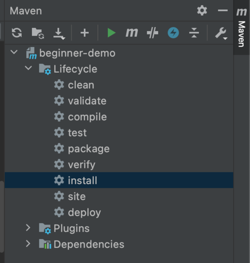

# demo-springboot-postgres
A Java application running in Spring Boot framework using Postgres DB on Docker. 
The goal of this project is to simulate one complete cycle from the `Controller Layer > Service Layer > Data Access Layer  > Postgres, and vice versa`. 
See diagram below:

### Dependencies:

     * Development Artifacts
        spring-boot-starter-web  : Support HTTP methods such as GET, POST, PUT, DELETE, so on...
        java                     : You may use versions above 8, Im using version 16
        postgresql               : "postgres:alpine" version is used since this is just a light weight app
        flyway-core              : In-charge with migration of data and validation of migration defined at 'V1__Persontable.sql' 
                                     after connection with DB is established.
        spring-jdbc              : Support SQL query, updates, queryforObject methods of Postgres
        HikariCP                 : Loads the configuration 'app:datasource' for Postgres-Docker at application.yml

    * Test Artifacts
        spring-boot-starter-test : Test libraries that has HTTP GET, POST, PUT, DELETE, so on... methods
        assertj-core             : Assertion functions for comparing and checking values
    

## This project supports `CRUD` API for Person. 

### Person

A `Person` has the ff. properties:

     - id: UUID        // This is auto-generated by the system when you ADD a person
     - name: String    // Full name of a person; value must not be null
     - birthday: Date  // Format is yyyy-mm-dd eg. "2020-07-23"
     - email: String   // Email address should be unique and value is not null
     - address: String // Home address of the person

### Sample Person in JSON format

    {
        "id": "ffdc6aa6-3b24-4238-b1ab-8b2b23c06d9e",
        "name": "Christen Press",
        "birthday": "1983-12-31",
        "email": "cpress23@google.com",
        "address": "1723 Malibu, California, USA"
    }

## PROCEDURE:
1. Using IntelliJ IDE, open the project folder and click its pom.xml
1. On the right side of the IDE, open the maven window. Click the beginner-demo > Lifecycle > Install

1. Select the 'target' folder, right click > Open in Terminal. Once you're in, you can now run the app.
   
    `java -jar beginner-demo-0.0.1-SNAPSHOT.jar`
   
1. In Postman, type URL `localhost:8080/api/v1/person/`, select method GET and click send. Check the status if its 200 OK. The method should return all the people that has been inserted (30 records) initially.

Sample Response:
   
       [
           {
           "id": "8a64b7bb-9e24-401a-be2b-1bf79278f416",
           "name": "Samuel Coe",
           "birthday": "2021-04-29",
           "email": "scoe0@ebay.com",
           "address": "97363 Upham Place"
           },
           {
           "id": "f09644dc-f1f6-4430-a077-525b759548fd",
           "name": "Aldus Kik",
           "birthday": null,
           "email": "akik2@patch.com",
           "address": "8347 Springs Circle"
           },
           {
           "id": "501b177c-7d64-40c9-833a-4a090f3bc654",
           "name": "Horatio Willcott",
           "birthday": null,
           "email": "hwillcott3@issuu.com",
           "address": "29 Ryan Terrace"
           },
           {
           "id": "09111bde-9047-4378-be31-885b36b6db0b",
           "name": "Hadley Kasbye",
           "birthday": "2020-07-02",
           "email": "hkasbye4@fotki.com",
           "address": "8750 Hooker Circle"
           },
         ...
       ]

*After this, try other methods (insert, delete, update person, and retrieve person by ID) in the API.*
